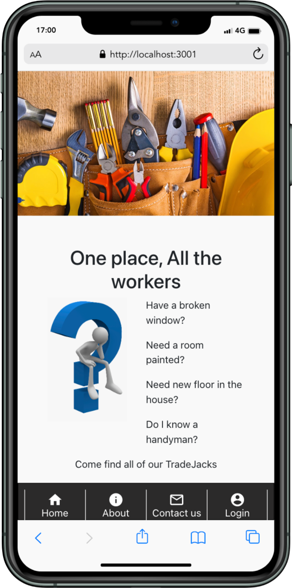

# Tradejack

## Mob programming By NinjaDevs  
Tradejack is a meeting place where clients and contractors can find each other and agree on work.  
This application is the frontend part of Ninja devs graduation project as javascript fullstack developer at [School of Applied Technology](https://github.com/saltsthlm)  
Tradejack API [here](https://github.com/Rawa08/Tradejack-backend)   
    

####  The members of  Ninja Devs: 
[Adam Csetneki](https://github.com/Tottzi)  
[Oscar](https://github.com/oscarstromsater)   
[Rawa Aref](https://github.com/rawa08)   

### Technologies Used  
React  
Redux  
[React Date Picker](https://www.npmjs.com/package/react-datepicker)  
[MATERIAL-UI](https://material-ui.com)
